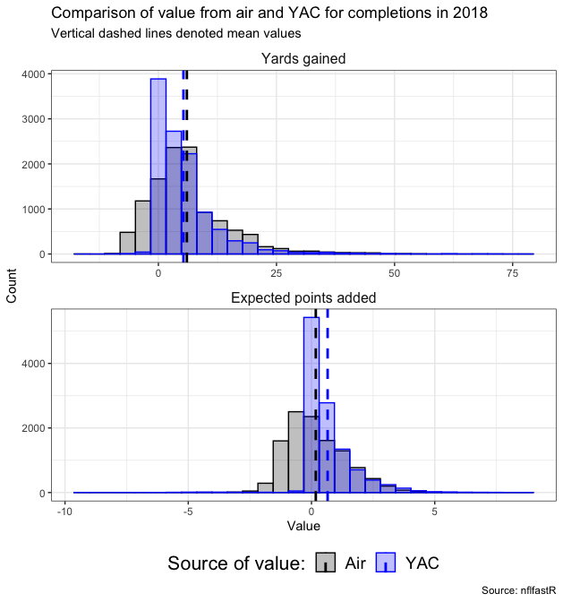

# Introduction

In every passing play, there are two separate yardage components that contribute to the final spot where the ball is placed: (i) air yards, the yards gained at the moment the ball was caught by the receiver, and (ii) yards after catch (YAC), which represents the *extra* yards gained from the receiver after the catch was made. The figure below displays a comparison of the distributions of value added through the air versus YAC in terms of both yards gained and expected points added for receptions in the 2018 season (access via nflfastR). It is evident that YAC represents a significant portion of the value of passing plays and warrants investigation into the role defenders play in limiting YAC.

**We introduce a framework for evaluating the ability of defenders to limit YAC**, which has two main components:

1. random forests for conditional density estimation (RFCDE) of the YAC distribution to account for high-dimensional features derived from player-tracking data and play-level context,
2. a deep learning-based model to estimate the expected locations of "ghosts" defenders given the location of other players on the field.

We are then able to compare how a defender's observed location at the moment the ball is caught affects the estimated distribution of the receiver's YAC relative to the "ghost" defender. By modeling the full YAC distribution instead of a point estimate for expected YAC, we are able to compute multiple ways of assessing player performance such as the ability to reduce the probability of the receiver obtaining a first down or touchdown.

# Modeling the YAC distribution with RFCDE

Let $Y$ denote the random variable for YAC. Rather than modeling the expected YAC ($\mathbb{E}[Y | X_i]$), where $X_i$ is some data structure encapsulating information about player-tracking and play-level data for reception $i \in 1,\dots, n$, we instead estimate the **conditional density function of YAC** $\hat{f}(y | X_i)$ using **random forests for conditional density estimation** (**RFCDE**)[1, 2]. RFCDE is a flexible approach for performing conditional density estimation in a high-dimensional setting, where the splits for random forest trees are chosen to minimize a loss specific to conditional density estimation [3] (see reference [1] for more details on RFCDE). By estimating $\hat{f}(y | X_i)$ directly, this allows us to estimate the **conditional cumulative distribution function** $\hat{F}(y |X_i) = \hat{Pr}(Y \leq y | X_i)$ enabling us to account for uncertainty in modeling YAC without any parametric assumptions. Furthermore, by modeling the entire YAC distribution, we are able to estimate relevant quantities such as the conditional probability of obtaining a first down, $\hat{Pr}(\text{first down} | X_i)$, or touchdown $\hat{Pr}(\text{touchdown} | X_i)$.  

Theoretically, YAC is a continuous random variable. However, in practice, we estimate $\hat{f}(Y | X_i)$ over a discrete grid of points defined separately for each play. For simplicity, we define this grid $\mathcal{G}_i$ in increments of half-yards ranging from -11 yards (smallest observed YAC in dataset) to the number of yards away the receiver is from the target endzone. We then compute discretized conditional probabilities by normalizing the density estimates to sum to one: 

$$
\hat{p}(y|X_i) = \frac{\hat{f}(y | X_i)}{\sum_{g \in \mathcal{G}_i} \hat{f}(y | X_i)}.
$$ 

We use these discrete conditional probability estimates to compute quantities such as the expected YAC $\hat{y}_i = \sum_{g \in \mathcal{G}_i} g \cdot \hat{p}(g|X_i)$, estimates for the conditional cumulative distribution function $\hat{Pr}(Y \leq y | X_i) = \sum_{g \in \mathcal{G}_i, g \leq y} \hat{p}(g|X_i)$. 

#### Features for RFCDE model

- TODO: Add example EDA visualizations demonstrating relationships

The first step in constructing the RFCDE model is to decide what features $X_i$ will be helpful in modeling the YAC distribution. We start with constructing features based on the player-tracking data in a similar manner to previous work on modeling running plays in Yurko et al (2020) [2]. We divide our player-tracking features between three types of players: the receiver / ball-carrier (`bc_`), receiver's teammates on offense (`offenseX`), and opposing players on defense (`defenseX`) players, where teammates and defenders are ordered based on their Euclidean distance to the ball-carrier (e.g., `defense1` is closest defender). The following table lists the features constructed for all three types of players:

| Feature                | Description                                            |
| :--------------------- | :----------------------------------------------------- |
| `adj_x`                | Horizontal yards from receiver’s target endzone.       |
| `adj_y`                | Vertical yards from center of field with respect to target endzone, where positive values indicate left side while negative values indicate right side.   |
| `dir_target_endzone`   | Direction player is facing with respect to the target endzone, where 0 indicates facing the endzone while positive degrees between 0 and 180 denote facing to the left while negative degrees between 0 and -180 denote facing to the right.                          |
| `s`                    | Speed in yards/second.                                 |
| `dis`                  | Distance traveled since previous frame.                |

We additionally construct features about the defenders and offensive teammates with respect to the receiver listed in the following table:

| Feature            | Description                                            |
| :----------------- | :----------------------------------------------------- |
| `adj_x_change`         | Difference between `adj_bc_x` and `X` closest offensive or defensive player’s `adj_x`. |
| `adj_y_change`         | Difference between `X` closest offensive or defensive player’s `adj_y` and `adj_bc_y`. |
| `dist_to_ball`     | Euclidean distance between X closest offensive or defensive player and ball-carrier. |
| `dir_wrt_bc_diff`  | Minimal absolute difference between `X` closest offensive or defensive player’s direction and the angle between them with the ball-carrier. |

A visual explanation of the adjusted x,y coordinates and direction features is displayed in the figure below (Figure 5 in reference [4]). The orange point denotes an example defender and the black point is an example ball-carrier. While the arrows denote the players' actual directions, we additionally compute the angle between the defender's direction with respect to the ball-carrier as `dir_wrt_bc_diff` as represented by the orange reference line. The dashed darkred lines denote the considered x,y -change features. 

INSERT-![Screen%20Shot%202021-01-03%20at%209.02.41%20PM.png]-(attachment:Screen%20Shot%202021-01-03%20at%209.02.41%20PM.png)

We also compute the following receiver / ball-carrier level features with information about the receiver relative to the QB at release as well as the location of the first down marker: 

| Feature                    | Description                                            |
| :------------------------- | :----------------------------------------------------- |
| `adj_x_change_to_qb`       | Difference between `bc_x_adj` and the quarterback's `x_adj` at time of release. |
| `adj_y_change_to_qb`       | Difference between `bc_y_adj` and the quarterback's `y_adj` at time of release. |
| `bc_dist_to_qb`            | Euclidean distance between quarterback and receiver at time of release. |
| `qb_s`  | Quarterback's speed in yards/second at release. |
| `adj_bc_x_from_first_down` | Horizontal yards from between receiver's location at time of catch and target first down.  |

- TODO: Add explanation of using absolute value version of y and direction with target endzone, noting symmetry in observed relationships regardless of left or right side of field (this may just go in the extended file rather than the one for submission)

Finally, we include the following play-level features that provide additional context about the play including information about players not captured in the tracking data such as personnel package info:  

| Feature                 | Description                                            |
| :---------------------- | :----------------------------------------------------- |
| `posteam_score_diff`    | Score differential with respect to the receiver's team.  |
| `down`                  | Down at the start of the play.   |
| `defendersInTheBox`     | Number of defenders in the box.                       |
| `n_{rb/wr/te/dl/lb/db}` | Number of RB, WR, or TEs on offense and DL, LB, or DB on defense.                               |
| `game_half`             | Numeric value denoting the game's half (first half = 1, second half = 2, overtime = 3).                |
| `half_sec_remain`       | Number of seconds remaining in half.                |
| `is_FORMATION`          | Indicator denoting the offense's formation including I_FORM, SINGLEBACK, SHOTGUN, EMPTY, PISTOL, WILDCAT, JUMBO, TRADITIONAL | 
| `is_DROPBACK`          | Indicator denoting the dropback type including SCRAMBLE_ROLLOUT_LEFT, SCRAMBLE_ROLLOUT_RIGHT, DESIGNED_ROLLOUT_RIGHT, DESIGNED_ROLLOUT_LEFT, SCRAMBLE, UNKNOWN  |

#### Model assessment

- TODO: explanation of different ways to assess RFCDE model
- TODO: overview of leave-one-week-out CV
- TODO: reason to choose number of players to include in model

While RFCDE implicitly performs variable selection at tree splits, we use leave-one-week-out (LOWO) cross-validation (CV) to evaluate the performance of our conditional density estimates, e.g., train on games in weeks one through sixteen, then test on holdout week seventeen. We evaluate the RFCDE performance for different subsets of the considered variables above:

1. receiver and play-level context,
2. receiver, play-level context, and increasing number of defenders,
3. receiver, play-level context, and increasing number of defenders and offensive teammates.

Additionally, we consider an appropriate baseline conditional density estimate that only uses the receiver's field position (`adj_bc_x`) at catch via the `npcdens()` function in the `np` package [5].

We evaluate the LOWO predictions with two criteria: (1) Continuous Ranked Probability Score (CRPS) of the conditional cumulative distribution function estimates $\hat{Pr}(Y \leq y | X_i)$ and (2) root mean-squared error (RMSE) of the expected YAC $\sqrt{\frac{1}{N}\sum_{i=1}^N (\hat{y}_i - y_i^*)^2}$.

We use a variant of the CRPS measure considered in last year's [Big Data Bowl](https://www.kaggle.com/c/nfl-big-data-bowl-2020/overview/evaluation):

$$
CRPS = \frac{1}{n} \sum_{i=1}^n \frac{1}{|\mathcal{G}_i|} \sum_{g \in \mathcal{G}_i} (\hat{Pr}(Y \leq g | X_i) - H(g - y_i))^2
$$
where $n$ is the number of plays, $\mathcal{G}_i$ is the grid of points considered for play $i$, and $y_i$ is the observed YAC for play $i$.

### Ghosting to evaluate player performance

- TODO: overview of deep learning approach for modeling expected coordinates

- TODO: explanation of process for computing differences between player and ghost

#### Compare player's performance to ghost

We use the YAC distribution estimates from our RFCDE model to evaluate the performance of a defender relative to the expected "ghost" positions from our deep learning model. For each defensive player $j \in 1,\dots, p$, we proceed in the following manner:

1. Identify all plays $n_j$ defensive player $j$ was one of the four closest defenders.
2. For each play $i \in n_j$:
  1. Compute summaries of YAC distribution, e.g., expected YAC $\hat{y}_i$ and estimated probability of first down $\hat{Pr}(\text{first down} |X_i)$, using player's actual $x,y$ coordinates and features $X_i$.
  2. Generate "ghost" version of features $X_i^*$ using player's ghost coordinates $x^*,y^*$. This includes updating the player's distance from receiver and order of defenders.
  3. Compute the analogous summaries of the "ghost" YAC distribution, e.g. $\hat{y}_i^*$ and $\hat{Pr}(\text{first down} |X_i^*)$.
  4. Compute difference between YAC summaries given player's observed positions versus "ghost" positions.

## Results

- TODO: brief summary of size of modeling dataset and number of plays

### RFCDE Leave-one-week-out cross-validation

- comparison to baseline univariate CDE based on field position

- comparison of considered set of covariates, justification for selection

INSERT !-[lowo_cv_summary.png]-(attachment:lowo_cv_summary.png)

### RFCDE variable importance

- ranking of RFCDE variables for selected modeling approach

INSERT !-[ave_var_importance.png]-(attachment:ave_var_importance.png)

### Evaluation of player performance relative to ghosts

- ranking of top players based on various distribution summaries

- figures displaying discriminatory ability of player evaluation between types of positions

INSERT!-[top_players_position.png]-(attachment:top_players_position.png)

### Example plays comparing player to ghost

- need to create displays with player positions and estimated YAC distributions

## Discussion

- our contributions - modeling the full distribution of YAC and using ghosting to evaluate player formance

- limitations - do not have every player on the field (may effect YAC models for short passing plays), single snapshot at-catch, do not adjust player speed and direction

- future work - full continuous time evaluation, address modeling all ghosts simultaneously for team evaluation, RFCDE may be limited in handling covariates versus CNNs

## References

1. Pospisil, T., & Lee, A. B. (2019). (f) RFCDE: Random Forests for Conditional Density Estimation and Functional Data. *arXiv preprint arXiv:1906.07177*.

2. Taylor Pospisil (2020). RFCDE: Random Forests for Conditional Density Estimation. R package version 0.3.1. https://github.com/tpospisi/RFCDE/tree/master/r

3. Izbicki, R., & Lee, A. B. (2017). Converting high-dimensional regression to high-dimensional conditional density estimation. Electronic Journal of Statistics, 11(2), 2800-2831.

4. Yurko, R., Matano, F., Richardson, L. F., Granered, N., Pospisil, T., Pelechrinis, K., & Ventura, S. L. (2020). Going deep: models for continuous-time within-play valuation of game outcomes in American football with tracking data. *Journal of Quantitative Analysis in Sports*, 1(ahead-of-print).

5. Tristen Hayfield and Jeffrey S. Racine (2008). Nonparametric Econometrics: The np Package. Journal of Statistical Software 27(5). URL http://www.jstatsoft.org/v27/i05/.

