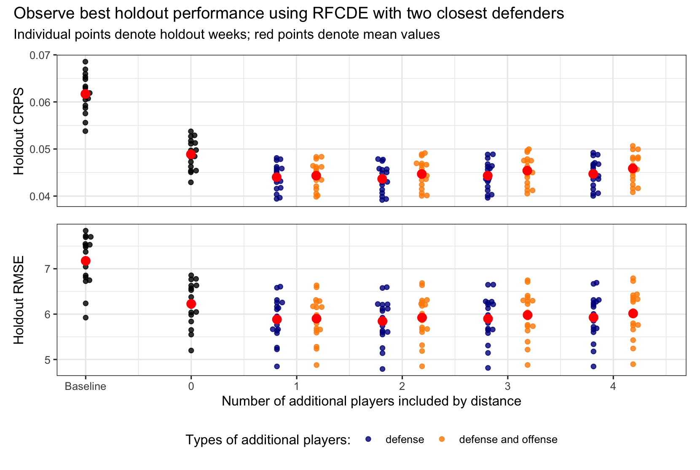
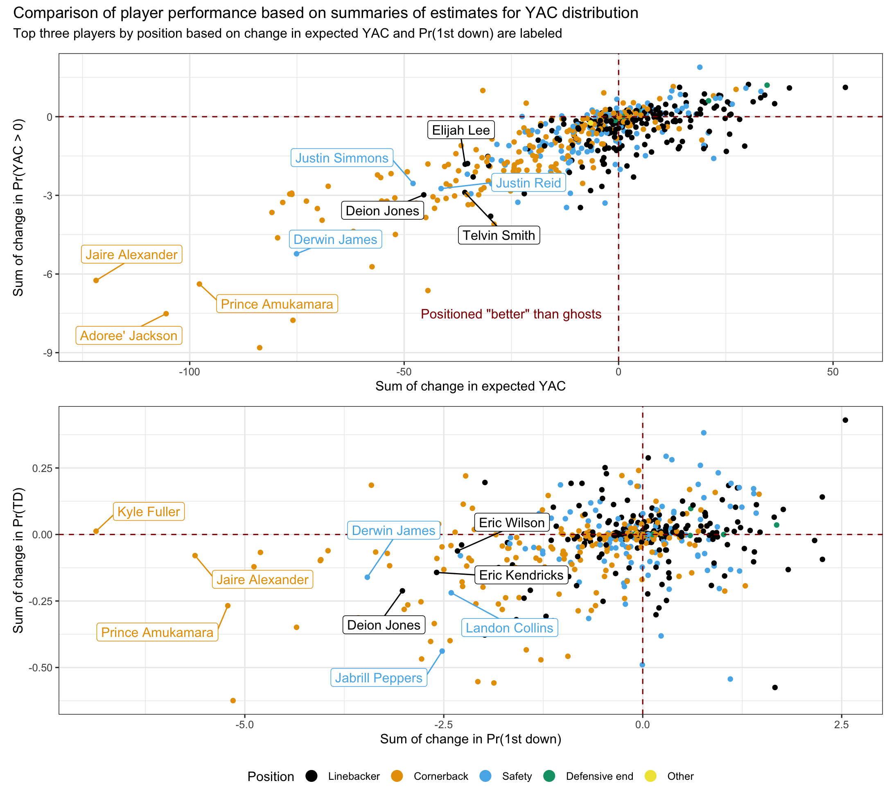

# Introduction

In every passing play, there are two separate yardage components that contribute to the final spot where the ball is placed: (i) air yards, the yards gained at the moment the ball was caught by the receiver, and (ii) yards after catch (YAC), which represents the *extra* yards gained from the receiver after the catch was made. The figure below displays a comparison of the distributions of value added through the air versus YAC in terms of both yards gained and expected points added for receptions in the 2018 season (access via nflfastR). It is evident that YAC represents a significant portion of the value of passing plays and warrants investigation into the role defenders play in limiting YAC.

**We introduce a framework for evaluating the ability of defenders to limit YAC**, which has two main components:

1. random forests for conditional density estimation (RFCDE) of the YAC distribution to account for high-dimensional features derived from player-tracking data and play-level context,
2. a deep learning-based model to estimate the expected locations of "ghosts" defenders given the location of other players on the field.

We are then able to compare how a defender's observed location at the moment the ball is caught affects the estimated distribution of the receiver's YAC relative to the "ghost" defender. By modeling the full YAC distribution instead of a point estimate for expected YAC, we are able to compute multiple ways of assessing player performance such as the ability to reduce the probability of the receiver obtaining a first down or touchdown.

# RFCDE model YAC distribution

Rather than modeling the expected YAC, $\mathbb{E}[YAC | X_i]$, where $X_i$ is some data structure encapsulating information about player-tracking and play-level data for reception $i \in 1,\dots, n$, we instead estimate the **conditional density function of YAC** $\hat{f}(yac | X_i)$ using **RFCDE**[1, 2]. RFCDE is a flexible, nonparametric approach for performing conditional density estimation in a high-dimensional setting, where the splits for random forest trees are chosen to minimize a loss specific to conditional density estimation [3]. By estimating $\hat{f}(yac | X_i)$ directly, this allows us to estimate the **conditional cumulative distribution function** $\hat{F}(yac |X_i) = \hat{Pr}(YAC \leq yac | X_i)$ enabling us to estimate relevant quantities such as the conditional probability of obtaining a first down, $\hat{Pr}(\text{1st down} | X_i)$, or touchdown $\hat{Pr}(\text{TD} | X_i)$.  

Theoretically, YAC is a continuous random variable. However, in practice, we estimate $\hat{f}(yac | X_i)$ over a discrete grid of points defined separately for each play. For simplicity, we define this grid $\mathcal{G}_i$ in increments of half-yards ranging from -11 yards (smallest observed YAC in dataset) to the number of yards away the receiver is from the target endzone. We then compute discretized conditional probabilities by normalizing the density estimates to sum to one: 

$$
\hat{p}(yac|X_i) = \frac{\hat{f}(yac | X_i)}{\sum_{g \in \mathcal{G}_i} \hat{f}(yac | X_i)}.
$$ 

We use these discrete conditional probability estimates to compute quantities such as the expected YAC $\hat{yac}_i = \sum_{g \in \mathcal{G}_i} g \cdot \hat{p}(g|X_i)$, and estimates for the conditional cumulative distribution function $\hat{Pr}(YAC \leq yac | X_i) = \sum_{g \in \mathcal{G}_i, g \leq yac} \hat{p}(g|X_i)$. 

## Considered features

We consider an initial set of features $X_i$ for our RFCDE model derived from information based on (1) the player-tracking data and (2) play-level context. We construct features based on the player-tracking data in a similar manner to previous work on modeling running plays in Yurko et al (2020) [2]. We divide player-tracking features between three groups of players:  the receiver / ball-carrier (`bc_`), receiver's teammates on offense (`offenseX`), and opposing players on defense (`defenseX`) players. We order teammates and defenders based on their Euclidean distance to the receiver at the moment of catch (e.g., `defense1` is the closest defender). While we focus on modeling the distribution of YAC at the moment of catch, we additionally consider relevant information about the receiver with respect to the quarterback **at the moment of release** such as the distance, horizontal / vertical displacement, and speed of the quarterback.  Furthermore, we include relevant play-level context such as the location of the first down marker relative to the receiver and other information about players not captured in the tracking data such as personnel package info. All of our considered features are listed in the table below.

| Feature                           | Type / players described      | Description                                            | 
| :-------------------------------- | ----------------------------- | :----------------------------------------------------- |
| `adj_x`                           | `bc_`, `offenseX`, `defenseX` | Horizontal yards from receiver’s target endzone.       |
| `adj_y`                           | `bc_`, `offenseX`, `defenseX` | Vertical yards from center of field with respect to target endzone, where positive values indicate left side while negative values indicate right side.   |
| `dir_target_endzone_absval`       | `bc_`, `offenseX`, `defenseX` | Absolute value of the player's direction with respect to the target endzone, where 0 indicates facing the endzone while 180 denotes facing opposite endzone.                          |
| `s`                               | `bc_`, `offenseX`, `defenseX` | Speed in yards/second.                                 |
| `dis`                             | `bc_`, `offenseX`, `defenseX` | Distance traveled since previous frame.                |
| `adj_x_change`                    | `offenseX`, `defenseX`        | Horizontal displacement between `adj_bc_x` and `X` closest offensive or defensive player’s `adj_x`. |
| `adj_y_change_absval`             | `offenseX`, `defenseX`        | Absolute value of vertical displacement between `X` closest offensive or defensive player’s `adj_y` and `adj_bc_y`. |
| `dist_to_ball`                    | `offenseX`, `defenseX`        | Euclidean distance between `X` closest offensive or defensive player and ball-carrier. |
| `dir_wrt_bc_diff`                 | `offenseX`, `defenseX`        | Minimal absolute difference between `X` closest offensive or defensive player’s direction and the angle between them with the ball-carrier. |
| `adj_x_change_to_qb`              | `bc_`                         | Horizontal displacement between `bc_x_adj` and the quarterback's `x_adj` at time of release. |
| `adj_y_change_to_qb_absval`       | `bc_`                         | Absolute value of vertical displacement between `bc_y_adj` and the quarterback's `y_adj` at time of release. |
| `bc_dist_to_qb`                   | `bc_`                         | Euclidean distance between quarterback and receiver at time of release. |
| `qb_s`                            | `bc_`                         | Quarterback's speed in yards/second at release. |
| `adj_bc_x_from_first_down`        | `bc_`                         | Horizontal yards from between receiver's location at time of catch and target first down.  |
| `posteam_score_diff`              | play-level                    |  Score differential with respect to the receiver's team.  |
| `down`                            | play-level                    |  Down at the start of the play.   |
| `defendersInTheBox`               | play-level                    |  Number of defenders in the box.                       |
| `n_{rb/wr/te/dl/lb/db}`           | play-level                    | Number of RB, WR, or TEs on offense and DL, LB, or DB on defense.                               |
| `game_half`                       | play-level                    | Numeric value denoting the game's half (first half = 1, second half = 2, overtime = 3).                |
| `half_sec_remain`                 | play-level                    | Number of seconds remaining in half.                |
| `is_FORMATION`                    | play-level                    | Indicator denoting the offense's formation including I_FORM, SINGLEBACK, SHOTGUN, EMPTY, PISTOL, WILDCAT, JUMBO, TRADITIONAL | 
| `is_DROPBACK`                     | play-level                    | Indicator denoting the dropback type including SCRAMBLE_ROLLOUT_LEFT, SCRAMBLE_ROLLOUT_RIGHT, DESIGNED_ROLLOUT_RIGHT, DESIGNED_ROLLOUT_LEFT, SCRAMBLE, UNKNOWN  |

## Model assessment 

While RFCDE implicitly performs variable selection at tree splits, we use leave-one-week-out (LOWO) cross-validation (CV) to evaluate the performance of our conditional density estimates, e.g., train on games in weeks one through sixteen, then test on holdout week seventeen. We evaluate the RFCDE performance for different subsets of the considered variables above:

1. receiver and play-level context,
2. receiver, play-level context, and `X` closest defenders ,
3. receiver, play-level context, and `X` closest defenders and offensive teammates.

Additionally, we consider an appropriate **baseline** conditional density estimate that only uses the receiver's field position (`adj_bc_x`) at catch via the `npcdens()` function in the `np` package [5]. Based on the varying number of players observed in the tracking data across plays, we limit our analysis up to including the four closest defenders and offensive teammates.

We evaluate the LOWO predictions with two criteria: (1) Continuous Ranked Probability Score (CRPS) of the conditional cumulative distribution function estimates $\hat{Pr}(YAC \leq yac | X_i)$ and (2) root mean-squared error (RMSE) of the expected YAC $\sqrt{\frac{1}{N}\sum_{i=1}^N (\hat{yac}_i - yac_i)^2}$, where $yac_i$ is the observed YAC for play $i$. We use a variant of the CRPS measure considered in last year's [Big Data Bowl](https://www.kaggle.com/c/nfl-big-data-bowl-2020/overview/evaluation):

$$
CRPS = \frac{1}{n} \sum_{i=1}^n \frac{1}{|\mathcal{G}_i|} \sum_{g \in \mathcal{G}_i} (\hat{Pr}(YAC \leq g | X_i) - H(g - y_i))^2
$$
where $n$ is the number of plays, $\mathcal{G}_i$ is the grid of points considered for play $i$, and $H()$ is the Heaviside step function.

The figure below displays the RFCDE LOWO CV results, where each individual point denotes the holdout week measure and the red points denote averages. It is clear the RFCDE estimates (starting with zero for receiver and play-level context) outperform the baseline, overall we do NOT observe an improvement in holdout performance after accounting for the two closest defenders. Thus, the remainder of our results will be based on the LOWO RFCDE models with information on the receiver, play-level context, and two closest defenders.

## Variable importance

For additional context, the following figure displays the top ten variables based on the average importance (calculated using conditional density estimation loss) across the seventeen LOWO models. 

# Ghosting to evaluate player performance

## Deep learning model of ghost defenders

The next module in our framework is a model that will imitate the movements of the defenders, based on how a **league-average** player would react. The idea is that for every defensive player we will use this ghosting model to estimate where a league-average defender (termed as *ghost defender*) would have been expected to be at the moment of catch. While defenders coordinate, and their locations are not independent (e.g., a defender reacts to actions by their teammates), we model the location of each defender separately. However, we condition our predictions on the position information of the rest of the defenders as well. This is partly due to the limitation of the data, i.e., we do not have information for all the players on the field, and partly due to the fact that we are really interested for a specific snapshot (the time of the catch) rather than a continuous trajectory of the ghost defenders. With these in mind our ghosting model for the $j^{th}, j \in \{1,2,3,4\}$ closest defender can be treated as a **sequence-to-sequence** problem, where the expected position of defender $j$ on play $i$, $\mathbb{E}[(x_i^j, y_i^j) |Z_{j,i}]$ is used as the position for the $j^{th}$ ghost defender $(x_i^{j*}, y_i^{j*})$. This expectation is conditioned on the sequence $Z_{j,i}$, which includes the following information:

* **offensive subsequence**: coordinates, speed, and direction for the receiver and their four closest teammates on offense.
* **defensive subsequence**: coordinates, speed, direction for the four closest defenders to the ball carrier, excluding the  $j^{th}$ closest defender's coordinates which we are modeling.
* **play-level subsequence**: receiver's yards from first down marker and additional play-level context in the table above.

To model $\mathbb{E}[(x_i^j, y_i^j) |Z_{j,i}]$, we built a stacked LSTM model. In particular, we use 3 LSTM layers, with 32 units, and a batch size of 128. We also use a dropout layer with a dropout rate of 0.2 and early stopping through a validation set. We additionally use the LOWO approach for the ghost defender estimates.

## Example play for CHI CB Kyle Fuller

To demonstrate the purpose using ghosting to evaluate players, the following figure displays an example play (10/21/2018 against New England) highlighting the position of Chicago Bears cornerback Kyle Fuller (in red) relative to his expected ghost position (in charcoal and connected by a red line). The remaining players on offense and defense are denoted in blue and orange respectively with their associated velocity vectors of movement at the moment of catch. We display below the field a comparison of the conditional density estimates using our RFCDE model between the observed location of Kyle Fuller (red) versus the ghost (charcoal). The yellow line denotes the location of the 1st down marker. As the figure indicates, Fuller was located right next to the receiver at the moment of catch, resulting in an expected YAC distribution heavily concentrated short of the 1st down marker ($\hat{Pr}(\text{1st down} |X_i) = 0.08$). Meanwhile, the expected ghost defender was positioned much further back resulting in a dramatically shifted YAC distribution yielding a much higher likelihood of 1st down for New England ($\hat{Pr}(\text{1st down} |X_i^*) = 0.89$). Ultimately, on this play Kyle Fuller tackled receiver Chris Hogan two yards short of the 1st down.

## Comparison of player performance to ghosts

We use the YAC distribution estimates from our RFCDE model to evaluate the performance of a defender relative to the expected "ghost" positions from our deep learning model. For each defensive player $j$, we proceed in the following manner:

1. Identify all plays $n_j$ defensive player $j$ was one of the four closest defenders.
2. For each play $i \in n_j$:
  1. Compute summaries of YAC distribution, e.g., expected YAC $\hat{yac}_i$ and estimated probability of first down $\hat{Pr}(\text{1st down} |X_i)$, using player's actual $(x_i^j, y_i^j)$ coordinates and features $X_i$.
  2. Generate "ghost" version of features $X_i^*$ using player's ghost coordinates $(x_i^{j*}, y_i^{j*})$. This includes updating the player's distance from receiver and order of defenders.
  3. Compute the analogous summaries of the "ghost" YAC distribution, e.g. $\hat{yac}_i^*$ and $\hat{Pr}(\text{1st down} |X_i^*)$.
  4. Compute difference between YAC summaries given player's observed positions versus "ghost" positions.
  
We focus on the sum of the differences in the various YAC summaries between a player and their ghost defenders, since we are limiting our analysis to the four closest defenders and e

## Comparison of player performances in 2018

We present our player-level results in terms of the sum of the differences between the player and their ghost defenders for four YAC summaries: (1) $Pr( YAC > 0)$, (2) expected YAC, (3) $Pr(TD)$, and (4) $Pr(\text{1st down})$. The following figure displays the player-level results for these summaries by position with the best three players in each position are labeled, according to sum of change in expected YAC and $Pr(\text{1st down})$ respectively. For both displays, players located in the bottom-left quadrant display "better" performance than their expected ghost defenders. Given our restriction to modeling the two closest defenders in the RFCDE model, we are not surprised to see a potential selection bias in players outperforming ghost defenders. We can see a slight positional effect with cornerbacks yielding better performance than their expected ghosts relative to other positions, but note that changes in $\hat{Pr}(\text{TD}$ appear more randomly dispersed than other summaries.

The following table displays the top five players by position in order of the sum of change in $Pr(\text{1st down})$, with orange color cells denoting better performance relative to ghost. 

# Discussion

We have introduced a framework for evaluating the impact of defenders on limiting YAC based on the combination of conditional density estimation with modeling defenders. We believe this framework presents a practical approach for summarizing the complexity of player-tracking data into intuitive summaries of player performance. Obviously, there are notable limitations to our work as exemplified in our example play above. We can not attribute the value of Fuller's position solely to himself without recognizing that the choice of Chicago's defensive scheme may have played a larger role. However, we can clearly improve our framework by accounting for such information to arrive at more informed positions for ghost defenders. Additionally, while we limited our analysis to the moment at catch, we can extend our modeling to full continuous-time evaluation but this poses a greater challenge in summarizing player-level performance to consider for future work. Finally, while we limited our ghosting model to just a single defender, we can extend our framework to evaluating team-level schemes by simulataneously modeling the joint structure of all defenders. While these avenues for future work are undoubtedly complex, they are achievable with the complete player-tracking data.

# References

1. Pospisil, T., & Lee, A. B. (2019). (f) RFCDE: Random Forests for Conditional Density Estimation and Functional Data. *arXiv preprint arXiv:1906.07177*.

2. Taylor Pospisil (2020). RFCDE: Random Forests for Conditional Density Estimation. R package version 0.3.1. https://github.com/tpospisi/RFCDE/tree/master/r

3. Izbicki, R., & Lee, A. B. (2017). Converting high-dimensional regression to high-dimensional conditional density estimation. Electronic Journal of Statistics, 11(2), 2800-2831.

4. Yurko, R., Matano, F., Richardson, L. F., Granered, N., Pospisil, T., Pelechrinis, K., & Ventura, S. L. (2020). Going deep: models for continuous-time within-play valuation of game outcomes in American football with tracking data. *Journal of Quantitative Analysis in Sports*, 1(ahead-of-print).

5. Tristen Hayfield and Jeffrey S. Racine (2008). Nonparametric Econometrics: The np Package. Journal of Statistical Software 27(5). URL http://www.jstatsoft.org/v27/i05/.

